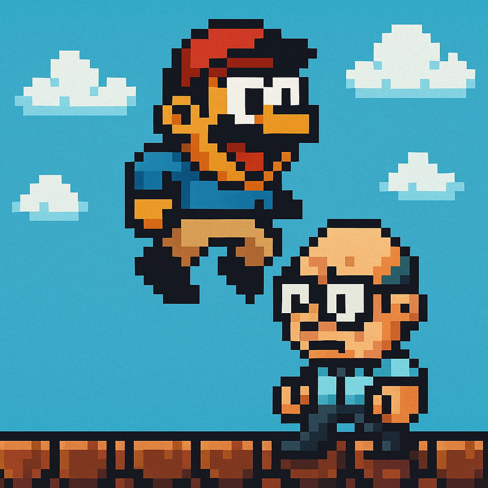
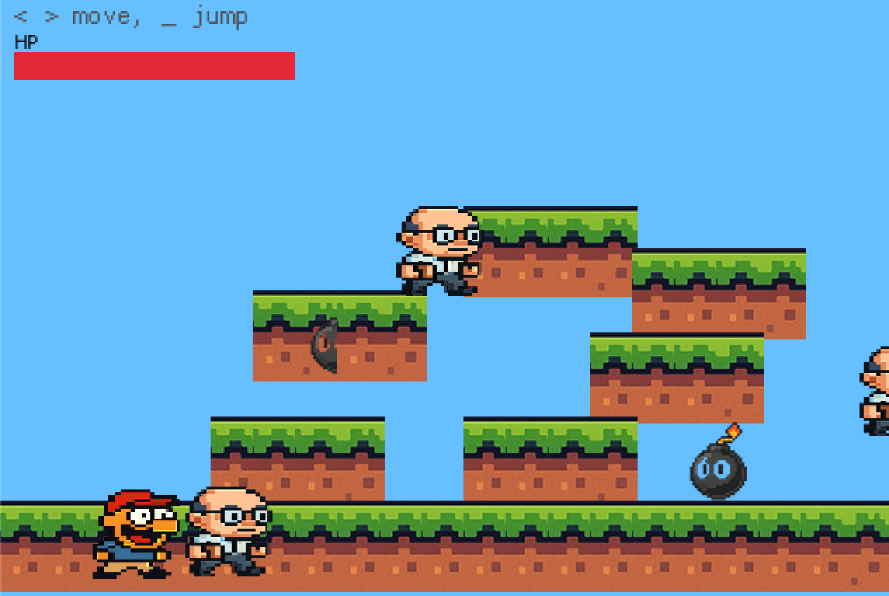

# 🎮 Rusty Mario — A Pixel Art Platformer in Pure Rust

Welcome to **Rusty Mario** — a classic side-scrolling platformer built from scratch in **Rust** using [`macroquad`](https://github.com/not-fl3/macroquad).

YouTube: https://youtu.be/WkRKJkpK7EA?si=aezlswroZAt_2Hrm

This game features:
- 🧍 A quirky hero named **Upyachka**
- 💥 Explosions and screen shake
- 💣 Bomb traps and health bar
- 😈 Nerdy IT enemies with patrol AI
- 🎨 Pixel-art animations
- 🔊 Sound effects and UI

> No Unity. No Godot. Just Rust + pixels + fun.

GamePlay:

...

## 📜 License

MIT License. Feel free to fork and build your own version!
